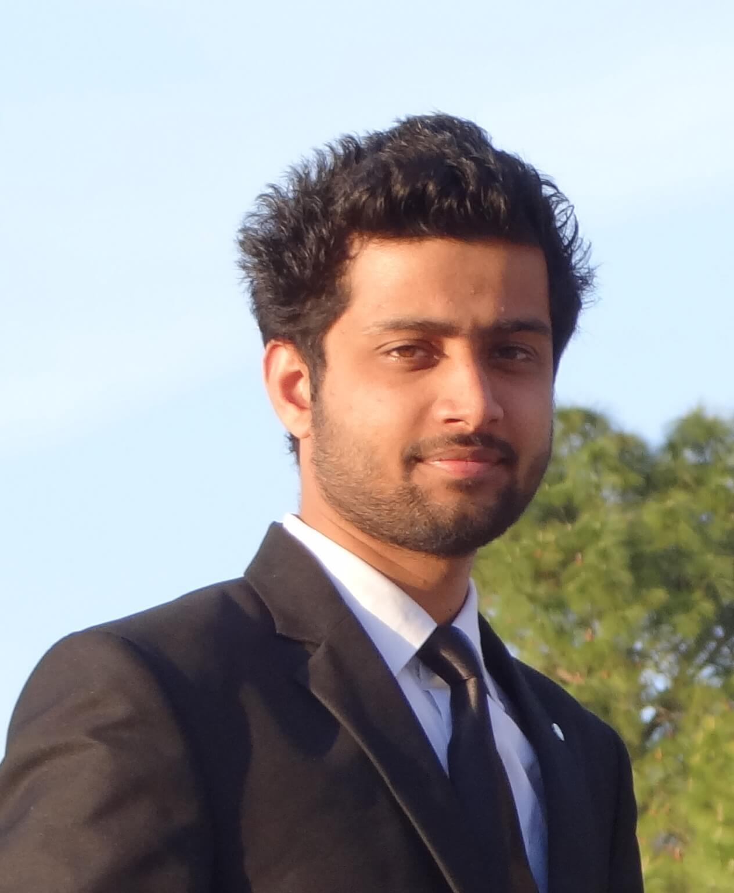



{:class="img-responsive"}

Hello Everyone!

I am Sahil Badyal, a Machine Learning Engineer at [Ameyo](https://www.ameyo.com) in Gurgaon. I completed by bachelors from [National Institute of Technology, Hamirpur](http://nith.ac.in). My home town is [Billawar](http://en.wikipedia.org/wiki/Billawar) in [Jammu and Kashmir](http://en.wikipedia.org/wiki/Jammu_and_Kashmir), where I have spent much of my childhood.

I am currently interested in Natural Language Processing and Deep Learning.

[CV](https://s3-ap-southeast-1.amazonaws.com/sahilbprojects/my-blog/SahilBadyal_CV_March_18.pdf){: .btn}  [LinkedIn](https://www.linkedin.com/in/sahilbadyal){: .btn}  [Email](mailto:me@sahilbadyal.com){: .btn}
 

###My Posts

<ul class="posts">
  
    <li>{{ post.date | date_to_string }} &raquo; <a href="{{ BASE_PATH }}{{ post.url }}">{{ post.title }}</a></li>
  
</ul>

