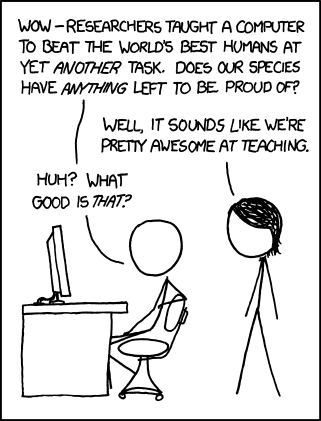



  
ML Researcher &amp; Data Science Manager &mdash; Generative AI, NLP &amp; Robotics

  <a href="https://s3-ap-southeast-1.amazonaws.com/sahilbprojects/my-blog/Sahil_Badyal_resume.pdf" class="btn" target="_blank">CV</a>
  <a href="https://github.com/sahilbadyal" class="btn" target="_blank">GitHub</a>
  <a href="https://www.linkedin.com/in/sahilbadyal" class="btn" target="_blank">LinkedIn</a>
  <a href="https://scholar.google.co.in/citations?hl=en&user=T65KqaMAAAAJ" class="btn" target="_blank">Publications</a>

[{:class="img-responsive"}](https://xkcd.com/894/){: target="_blank"}

  
I am a Machine Learning Researcher and Data Science Manager with 7+ years of experience designing and deploying novel methods in Generative AI, NLP, and Robotics. Currently, at <a href="https://capitalone.com" target="_blank">Capital One</a>, I lead teams building next-generation LLM systems, prompt optimization workflows, and high-valuation risk model integrations.

  
My technical journey blends deep theoretical research with web-scale production engineering. I have successfully built and optimized conversational agents, fraud-detection transformer models, and deep-learning recommendation systems that scale to millions of users.

  
As a published author in EACL, COLING, and IEEE, I love tackling complex problems in computational linguistics and multi-agent reinforcement learning. I hold an MS in Computer Science from Arizona State University.

  
<strong>Core Expertise:</strong> Generative AI, LLM Agents, NLP, Multi-Agent Reinforcement Learning (MARL), PyTorch, JAX, Distributed Systems, and MLOps.

### Recent Posts

<ul class="posts-list">
  
  <li>
    
<a href="{{ post.url }}">{{ post.title }}</a>

    

      {{ post.date | date: "%B %d, %Y" }}
      &middot; {{ post.content | number_of_words | divided_by: 200 | plus: 1 }} min read
      &middot; {{ post.categories | join: ", " }}
    

  </li>
  
</ul>

<a class="view-all" href="/archive.html">View all posts &rarr;</a>
